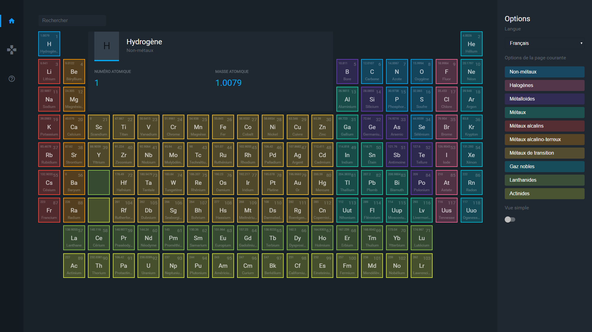

# Mendelable

> Mendelable displays information about the elements of the periodic table in a modern and pleasant way.

[](https://pulsardev.github.io/mendelable/)

## Table of Contents

- [Build Setup](#build-setup)
- [Something Missing?](#something-missing)

## Build Setup

``` bash
# install dependencies
npm install

# serve with hot reload at localhost:8080
npm run dev

# build for production with minification
npm run build

# build for production and view the bundle analyzer report
npm run build --report

# run unit tests
npm run unit

# run e2e tests
npm run e2e

# run all tests
npm test

# generate the full changelog
git-changelog -t false -a "Mendelable"
```

For detailed explanation on how things work, checkout the [guide](http://vuejs-templates.github.io/webpack/) and [docs for vue-loader](http://vuejs.github.io/vue-loader).

## Something Missing?

If you have a feature request or found a bug, [let me know](https://github.com/pulsardev/mendelable/issues).
